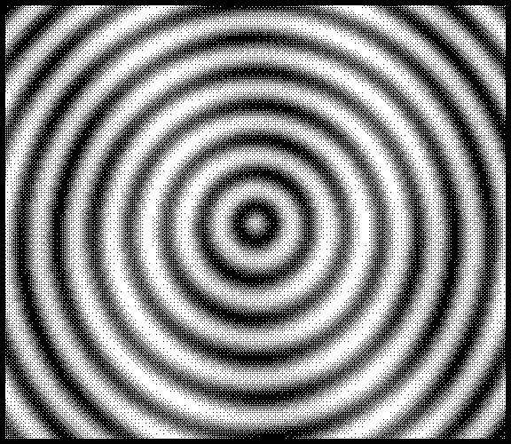
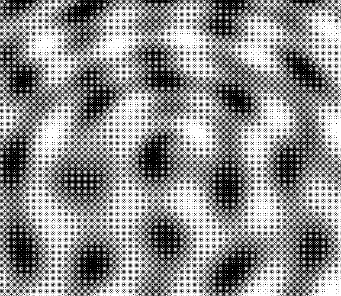
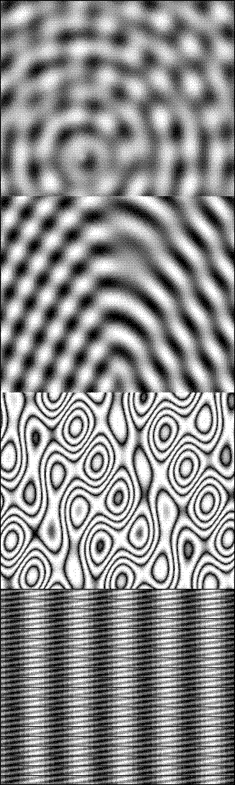
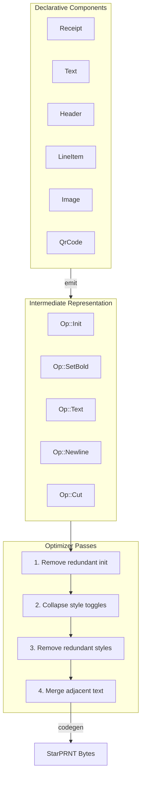

estrella
========

A print server for the [StarPRNT](https://starmicronics.com/support/download/starprnt-command-specifications/) protocol, targetting the [Star Micronics TSP650II](https://star-m.jp/eng/products/s_print/tsp650ii/index.html) thermal printer.


## Usage

```bash
# List available patterns and receipts
estrella print

# Print a visual pattern
estrella print ripple

# Save pattern as PNG (patterns only)
estrella print --png output.png waves

# Custom dimensions
estrella print --height 1000 --width 576 sick

# Print a demo receipt
estrella print receipt

# Print full receipt with barcodes (Code39, QR, PDF417)
estrella print receipt-full

# Store a logo in printer's NV (non-volatile) memory
estrella logo store mylogo.png --key A0

# Delete a stored logo
estrella logo delete --key A0

# Delete ALL stored logos (with confirmation)
estrella logo delete-all
```

## Patterns

### Ripple
Radial ripples with wobble interference - creates a hypnotic expanding wave effect.



### Waves
Multi-oscillator interference pattern - overlapping sine waves create complex moiré effects.



### Sick
Four-section test pattern for calibration and visual effects:
- Plasma/Moiré interference
- Concentric rings with diagonal waves
- Topographic contour lines
- Glitch effect with scanlines



### Calibration
Diagnostic pattern with borders, X-shaped diagonals, and progressive-width vertical bars.


## Receipts

### receipt
Simple demo receipt showcasing text styling:
- Bold headers with size scaling
- Inverted (white on black) banners
- Underline and upperline (boxed text)
- Item list with totals
- Reduced printing (fine print)
- Upside-down text

### receipt-full
Full demo receipt with all features:
- Everything from `receipt`
- NV logo (prints logo stored with key "A0" if available)
- Font showcase (A, B, C)
- Style showcase (all text effects)
- Code39 barcode with HRI
- QR code
- PDF417 barcode

## Component Library

Estrella includes a declarative component system for building receipts, inspired by React. Instead of manually constructing byte sequences, you describe *what* you want and the system figures out the optimal printer commands.

### Architecture



### Optimization Example

The optimizer removes redundant operations. For example, when two `Text` components with the same style are adjacent:

```
Before optimization:          After optimization:
─────────────────────         ─────────────────────
SetBold(true)                 SetBold(true)
Text("Hello")                 Text("Hello World")
Newline                       Newline
SetBold(false)                SetBold(false)
SetBold(true)      ──────►    [removed - collapsed]
Text(" World")                [merged with above]
Newline                       [merged with above]
SetBold(false)                [removed - collapsed]
```

This produces **smaller output** while maintaining identical visual results.

### Basic Example

```rust
use estrella::components::*;

let receipt = Receipt::new()
    .child(Text::new("HELLO WORLD").center().bold())
    .child(Text::new("Welcome to Estrella"))
    .cut();

// Compile to optimized bytes
let bytes = receipt.build();
```

### Full Receipt Example

```rust
use estrella::components::*;

let receipt = Receipt::new()
    // Header
    .child(Text::new("CHURRA MART").center().bold().size(2, 2))
    .child(Text::new("2024-01-20 12:00:00").center())
    .child(Spacer::mm(3.0))

    // Inverted banner
    .child(Text::new(" TODAY ONLY: 50% OFF ").center().invert().bold())
    .child(Spacer::mm(2.0))

    // Line items
    .child(LineItem::new("Espresso", 4.50))
    .child(LineItem::new("Croissant", 3.25))
    .child(Divider::dashed())

    // Totals
    .child(Total::labeled("SUBTOTAL:", 7.75))
    .child(Total::labeled("TAX:", 1.01))
    .child(Total::new(8.76).bold().double_width())
    .child(Spacer::mm(3.0))

    // QR code
    .child(Text::new("Scan for rewards:").center())
    .child(QrCode::new("https://example.com/rewards").cell_size(6))
    .child(Spacer::mm(4.0))

    // Footer
    .child(Text::new("Thank you!").center().bold())
    .child(Spacer::mm(6.0))
    .cut();

let bytes = receipt.build();
```

### Available Components

| Component | Description |
|-----------|-------------|
| `Receipt` | Root container, handles init and optional cut |
| `Text` | Styled text with alignment, bold, underline, size, etc. |
| `Header` | Pre-styled centered bold header |
| `LineItem` | Left name + right price formatting |
| `Total` | Right-aligned totals with optional bold/double-width |
| `Divider` | Horizontal line (dashed, solid, double, equals) |
| `Spacer` | Vertical space in mm or line units |
| `Image` | Raster graphics (band or raster mode) |
| `Pattern` | Named pattern generator (ripple, waves, etc.) |
| `NvLogo` | Print logo from NV (non-volatile) memory with optional scaling |
| `QrCode` | QR code with configurable size and error correction |
| `Pdf417` | PDF417 2D barcode |
| `Barcode` | 1D barcodes (Code39, Code128, EAN-13, UPC-A, ITF) |
| `Raw` | Escape hatch for direct IR ops or bytes |

### Text Styling Methods

```rust
Text::new("content")
    .center()           // Alignment: .left(), .center(), .right()
    .bold()             // Emphasis
    .underline()        // Underline
    .upperline()        // Line above text
    .invert()           // White on black
    .double_width()     // 2x width
    .double_height()    // 2x height
    .size(2, 2)         // Custom size multiplier (0-7)
    .font(Font::B)      // Font: A (12x24), B (9x24), C (9x17)
    .upside_down()      // Rotate 180°
    .smoothing()        // Enable character smoothing
```

### Graphics Modes

For pattern/image printing, two modes are available:

```rust
// Raster mode (default) - arbitrary height, sent in chunks
Image::from_raster(576, 500, data).raster_mode()

// Band mode - 24-row chunks, matches original Python implementation
Image::from_raster(576, 480, data).band_mode()
```

## NV Graphics (Logos)

NV (Non-Volatile) graphics are images stored in the printer's flash memory. They persist across power cycles and can be recalled instantly, making them perfect for logos and frequently-used graphics.

### Storing a Logo

Use the CLI to store a PNG image in the printer's memory:

```bash
# Store logo with key "A0" (default)
estrella logo store mylogo.png

# Store with custom key
estrella logo store company-logo.png --key LG

# Store at different width
estrella logo store badge.png --key B1 --width 288
```

The image will be:
- Converted to grayscale
- Scaled to fit the specified width (maintaining aspect ratio)
- Dithered using Bayer 8x8 ordered dithering
- Stored in the printer's NV memory with the specified 2-character key

### Using Logos in Code

```rust
use estrella::components::*;

let receipt = Receipt::new()
    // Print stored logo at 1x scale
    .child(NvLogo::new("A0"))
    .child(Spacer::mm(3.0))

    .child(Text::new("ACME CORP").center().bold())
    .child(Text::new("Thank you for your business!").center())
    .cut();
```

### Logo Scaling

Logos can be scaled 1x or 2x:

```rust
// 1x scale (default)
NvLogo::new("A0")

// 2x scale (double size)
NvLogo::new("A0").scale(2)
NvLogo::new("A0").double()  // shorthand

// Custom horizontal/vertical scaling
NvLogo::new("A0").scale_x(2).scale_y(1)
```

### Managing Logos

```bash
# Delete a specific logo
estrella logo delete --key A0

# Delete all logos (with confirmation)
estrella logo delete-all

# Skip confirmation
estrella logo delete-all --force
```

### Key Format

Logo keys must be exactly 2 printable ASCII characters (32-126):
- Valid: `A0`, `LG`, `01`, `__`, `~~`
- Invalid: `A` (too short), `ABC` (too long)

### Notes

- Logos persist in printer memory until explicitly deleted or power is lost
- The printer has limited NV storage; exact capacity varies by model
- If a logo key doesn't exist, the print command is silently ignored
- Logos are printed at the current line position and advance the paper

## Development

```bash
make build      # Build release binary
make test       # Run all tests
make format     # Format code
make golden     # Regenerate golden test images
make help       # Show all targets
```
