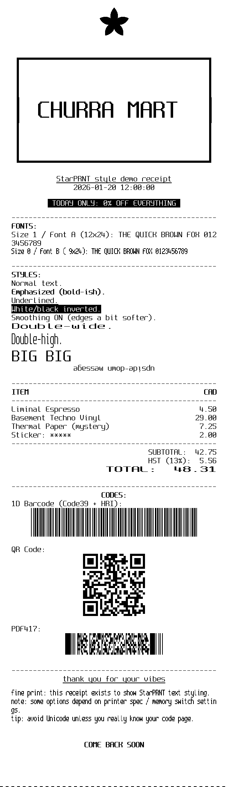

# estrella

A Rust library and CLI for [Star Micronics TSP650II](https://star-m.jp/eng/products/s_print/tsp650ii/index.html) thermal receipt printers. Implements the [StarPRNT](https://starmicronics.com/support/download/starprnt-command-specifications/) protocol for text formatting, graphics rendering, barcode printing, and more.


## Component System

Estrella provides a declarative, React-inspired component system for building receipts. Instead of manually sending printer commands, you describe *what* you want and the system handles the rest.

```rust
use estrella::components::*;

let receipt = Receipt::new()
    .child(Text::new("CHURRA MART").center().bold().size(2, 2))
    .child(Text::new("2026-01-20 12:00:00").center())
    .child(Spacer::mm(3.0))
    .child(Text::new(" TODAY ONLY: 50% OFF ").center().invert().bold())
    .child(Divider::dashed())
    .child(LineItem::new("Espresso", 4.50))
    .child(LineItem::new("Croissant", 3.25))
    .child(Divider::dashed())
    .child(Total::new(7.75).bold().double_width())
    .child(Spacer::mm(3.0))
    .child(QrCode::new("https://example.com/rewards").cell_size(6))
    .child(Text::new("Thank you!").center().bold())
    .cut();

let bytes = receipt.build();  // Ready to send to printer
```

### Available Components

| Component | Description |
|-----------|-------------|
| `Receipt` | Root container, handles init and optional cut |
| `Text` | Styled text with alignment, bold, underline, size, etc. |
| `Header` | Pre-styled centered bold header |
| `LineItem` | Left-aligned name + right-aligned price |
| `Total` | Right-aligned totals with optional bold/double-width |
| `Divider` | Horizontal line (dashed, solid, double, equals) |
| `Spacer` | Vertical space in mm or line units |
| `Image` | Raster graphics (band or raster mode) |
| `Pattern` | Named pattern generator (ripple, waves, etc.) |
| `NvLogo` | Print logo from NV memory with optional scaling |
| `QrCode` | QR code with configurable size and error correction |
| `Pdf417` | PDF417 2D barcode |
| `Barcode` | 1D barcodes (Code39, Code128, EAN-13, UPC-A, ITF) |

### Text Styling

```rust
Text::new("content")
    .center()           // Alignment: .left(), .center(), .right()
    .bold()             // Bold emphasis
    .underline()        // Underline
    .upperline()        // Line above text
    .invert()           // White on black
    .double_width()     // 2x width
    .double_height()    // 2x height
    .size(2, 2)         // Custom size multiplier (0-7)
    .font(Font::B)      // Font: A (12x24), B (9x24), C (9x17)
    .upside_down()      // Rotate 180°
```

## Receipts

### Demo Receipt

Showcases text styling capabilities:

- Bold headers with size scaling
- Inverted (white on black) banners
- Underline and upperline (boxed text)
- Item list with totals
- Reduced printing (fine print)
- Upside-down text


### Full Receipt

Everything from demo receipt, plus:

- NV logo support
- Font showcase (A, B, C)
- Code39 barcode with HRI
- QR code
- PDF417 barcode



## Architecture

Components compile to an intermediate representation (IR), which is then optimized and converted to StarPRNT bytes:

```
┌─────────────────────────────────────────────────────────────────────────────┐
│                              COMPILATION PIPELINE                           │
├─────────────────────────────────────────────────────────────────────────────┤
│                                                                             │
│   ┌─────────────┐      ┌─────────────┐      ┌─────────────┐      ┌───────┐  │
│   │  Components │      │     IR      │      │  Optimizer  │      │ Bytes │  │
│   │             │      │             │      │             │      │       │  │
│   │  Receipt    │      │  Op::Init   │      │  4 passes   │      │ ESC @ │  │
│   │  Text       │ ───► │  Op::Text   │ ───► │  that remove│ ───► │ ...   │  │
│   │  QrCode     │ emit │  Op::Bold   │      │  redundant  │ gen  │ 1D 69 │  │
│   │  ...        │      │  Op::Cut    │      │  operations │      │ ...   │  │
│   │             │      │  ...        │      │             │      │       │  │
│   └─────────────┘      └─────────────┘      └─────────────┘      └───────┘  │
│                                                                             │
└─────────────────────────────────────────────────────────────────────────────┘
```

### Optimizer Passes

The optimizer runs four passes to produce smaller output:

```
Pass 1: Remove Redundant Init     Pass 2: Collapse Style Toggles
┄┄┄┄┄┄┄┄┄┄┄┄┄┄┄┄┄┄┄┄┄┄┄┄┄┄┄┄┄     ┄┄┄┄┄┄┄┄┄┄┄┄┄┄┄┄┄┄┄┄┄┄┄┄┄┄┄┄┄┄┄
Init  ←── keep                    SetBold(true)
...                               Text("Hello")
Init  ←── remove                  SetBold(false) ┐
...                               SetBold(true)  ┘── remove pair
Init  ←── remove                  Text("World")


Pass 3: Remove Redundant Styles   Pass 4: Merge Adjacent Text
┄┄┄┄┄┄┄┄┄┄┄┄┄┄┄┄┄┄┄┄┄┄┄┄┄┄┄┄┄┄    ┄┄┄┄┄┄┄┄┄┄┄┄┄┄┄┄┄┄┄┄┄┄┄┄┄┄┄┄
SetBold(true)                     Text("Hello")  ┐
Text("A")                         Newline        │── merge into
SetBold(true) ←── remove          Text("World")  ┘   "Hello\nWorld"
Text("B")
```

### Before/After Example

```
BEFORE OPTIMIZATION               AFTER OPTIMIZATION
───────────────────               ──────────────────
Op::Init                          Op::Init
Op::SetBold(true)                 Op::SetBold(true)
Op::Text("Hello")                 Op::Text("Hello World")
Op::Newline                       Op::Newline
Op::SetBold(false)     ─┐         Op::SetBold(false)
Op::SetBold(true)      ─┘ gone    Op::Cut
Op::Text(" World")     ─┐
Op::Newline            ─┘ merged
Op::SetBold(false)     ── gone
Op::Cut

         11 ops  ───────►  6 ops
```

This produces **~5-8% smaller output** while maintaining identical visual results.

## Patterns

Visual patterns for testing and artistic prints. Each pattern lives in its own file under `src/art/`.

### Ripple ([source](src/art/ripple.rs))

Radial ripples with wobble interference - creates a hypnotic expanding wave effect.


### Waves ([source](src/art/waves.rs))

Multi-oscillator interference pattern - overlapping sine waves create complex moiré effects.


<details>
<summary>More patterns</summary>

### Plasma ([source](src/art/plasma.rs))

Plasma/Moiré interference pattern with smooth color transitions.


### Rings ([source](src/art/rings.rs))

Concentric rings with diagonal wave interference.


### Topography ([source](src/art/topography.rs))

Topographic contour lines simulating elevation maps.


### Glitch ([source](src/art/glitch.rs))

Digital glitch effect with scanlines and noise.


### Microfeed ([source](src/art/microfeed.rs))

Horizontal lines with progressively increasing spacing - tests printer feed accuracy.


### Density ([source](src/art/density.rs))

Ripple pattern at three different gamma levels for density testing.


### Overburn ([source](src/art/overburn.rs))

Double-pass darkening effect for maximum ink density.


### Jitter ([source](src/art/jitter.rs))

Banding and scanline artifacts pattern.


### Calibration ([source](src/art/calibration.rs))

Diagnostic pattern with borders, X-shaped diagonals, and progressive-width vertical bars.


</details>

## Weave (Pattern Crossfades)

Blend multiple patterns together with smooth DJ-style crossfade transitions.

```bash
# Blend 3 patterns over 150mm with 30mm crossfades
estrella weave riley plasma waves --length 150mm --crossfade 30mm --png output.png
```


### Options

| Option | Description |
|--------|-------------|
| `--length` | Total output length (e.g., `500mm`) |
| `--crossfade` | Transition length between patterns (default: `30mm`) |
| `--curve` | Blend curve: `linear`, `smooth` (default), `ease-in`, `ease-out` |
| `--golden` | Use deterministic parameters |
| `--png FILE` | Output to PNG instead of printing |

## NV Graphics (Logos)

Store images in the printer's non-volatile flash memory for instant recall across power cycles.

### Storing a Logo

```bash
estrella logo store mylogo.png              # Store with key "A0" (default)
estrella logo store logo.png --key LG       # Custom 2-char key
estrella logo store badge.png --width 288   # Custom width
```

Images are automatically converted to grayscale, scaled, and dithered using Bayer 8x8 ordered dithering.

### Using Logos in Code

```rust
let receipt = Receipt::new()
    .child(NvLogo::new("A0"))                    // 1x scale
    .child(NvLogo::new("LG").double())           // 2x scale
    .child(NvLogo::new("B1").scale_x(2).scale_y(1))  // Custom scaling
    .child(Text::new("ACME CORP").center().bold())
    .cut();
```

### Managing Logos

```bash
estrella logo delete --key A0       # Delete specific logo
estrella logo delete-all            # Delete all (with confirmation)
estrella logo delete-all --force    # Skip confirmation
```

**Key format:** Exactly 2 printable ASCII characters (e.g., `A0`, `LG`, `01`)

## Usage

```bash
# List available patterns and receipts
estrella print

# Print patterns
estrella print ripple
estrella print waves
estrella print --height 1000 plasma

# Save as PNG preview
estrella print --png output.png ripple

# Print receipts
estrella print receipt
estrella print receipt-full

# Logo management
estrella logo store mylogo.png --key A0
estrella logo delete --key A0
```

## Development

```bash
make build      # Build release binary
make test       # Run all tests
make format     # Format code
make golden     # Regenerate golden test files
make help       # Show all targets
```

### Graphics Modes

Two modes for image/pattern printing:

```rust
// Raster mode (default) - arbitrary height
Image::from_raster(576, 500, data).raster_mode()

// Band mode - 24-row chunks, more efficient for streaming
Image::from_raster(576, 480, data).band_mode()
```

### Hardware

- **Printer:** Star Micronics TSP650II
- **Paper:** 80mm (72mm printable area)
- **Resolution:** 203 DPI (576 dots across)
- **Interface:** Bluetooth RFCOMM at `/dev/rfcomm0`
